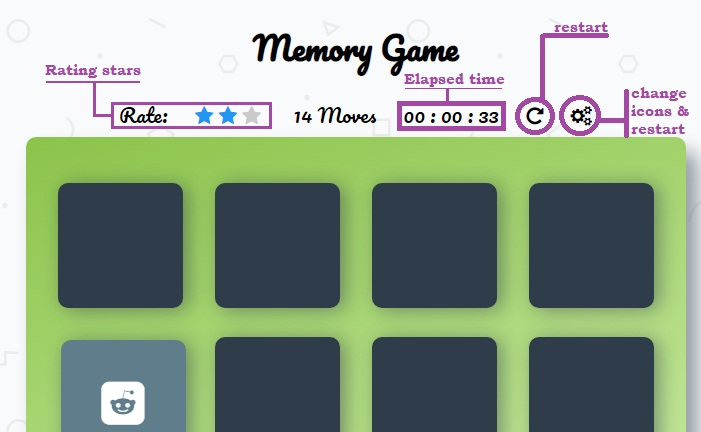
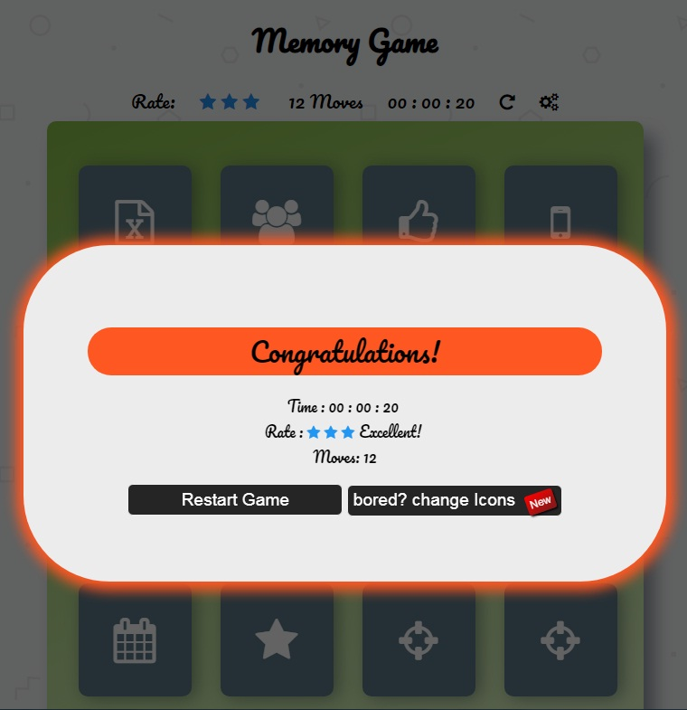

# Memory Game Project

## CONTENTS

>1. [SYSTEM REQUIREMENTS](#SYSTEM-REQUIREMENTS)
>2. [ABOUT THE GAME](#ABOUT_THE_GAME)
>3. [INSTRUCTIONS](#INSTRUCTIONS)
>4. [RATING](#RATING)
>5. [EXTRAS](#EXTRAS)
>6. [PHOTOS](#PHOTOS)
>7. [CONTACT INFORMATION](#CONTACT-INFORMATION)

## SYSTEM REQUIREMENTS

- Supported by any internet browser. google chrome &copy; is Recommended
- Supported Operating Systems are: All Windows &copy; versions, Mac &copy;, Andriod &copy;....
- Internet connection is ```reqiured```, only on page loading for downloading icons link. 

	
## ABOUT THE GAME
### What is Memory Game?
**Matching games** or **Memory games** are games that require players to match similar elements. As the name implies, participants need to find a match for a word, picture, or card. [(wikipedia)](https://en.wikipedia.org/wiki/Matching_game)

It make you have good practice for your memory, and gives you a good concentration skills.

## INSTRUCTIONS

- This game consists of 8 pairs of icon cards.
- You have to find the pairs in lowest number of card clicks.
- Click on a card, then it will flip and the Icon appears.
- Click another one, the other icon will appears too.
- If both icons are NOT identic, then the cards will flip again and icons will disappear.
- At this point, try to keep the icons shape and location in your mind to recall them later.
- If both cards are identic, then they won't flip again, and icons will not be hidden this time.
- Once you finish matching all 16 cards. the game ends, and a modal panel appears showing your rate, time and number of moves.


## RATING
Your rate depends on your moves (clicks, how many times you opened the cards).
|**Moves**|**Rating**|**Note**|
|----|----|----|
| \[ 0 , 13 \[		|	3 stars	|	`Excellent`	|
| \[ 13 , 16 \[	|	2 stars	|	`Good`		|
| \[ 16 , 19 \[	|	1 star	|	`Bad`		|
| \[ 19 , inf \[	|	0 stars	|	`Awful`		|


## EXTRAS
> **TIP:** This game consists of additional **``852 icons``**, so if you get bored of the default icons, change them when modal panel appears.

## PHOTOS
-  menu



-  modal panel



## CONTACT INFORMATION

For any further information, I will be happy to hear from you.
[Hasan Shofan](mailto:Mark_mimo_marko@hotmail.com) 2019

